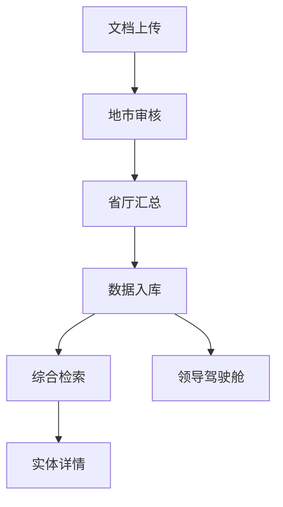

## 1. 产品概述
案件检索系统是一个面向省/市公安系统的智能数据治理与研判平台，解决“一人多职、一事多部门”的数据孤岛问题。
- 通过归属单位+业务标签双轨管理，实现跨部门实体关联、智能检索、知识图谱分析、事件时间轴追溯及领导驾驶舱可视化。
- 目标用户为公安系统内部人员，包括地市上传员、地市审核员、省厅审核员和普通干警/领导。

## 2. 核心功能

### 2.1 用户角色
| 角色 | 注册方式 | 核心权限 |
|------|----------|----------|
| 地市上传员 | 系统分配 | 上传文档、绑定归属/标签 |
| 地市审核员 | 系统分配 | 校验归属、合并本单位重复实体、补充标签 |
| 省厅审核员 | 系统分配 | 跨地市实体合并、最终确认、分配未归属数据 |
| 普通干警/领导 | 系统分配 | 检索、查看图谱、驾驶舱 |

### 2.2 功能模块
1. **文档上传页面**：文件上传、元数据填写、提交上传
2. **地市审核页面**：待审实体列表、实体合并、通过/驳回
3. **省厅汇总页面**：跨地市实体合并、统一标准名称
4. **综合检索页面**：百度风格搜索、结果分页签、多归属展示
5. **实体详情页面**：实体基础信息、知识图谱、事件时间轴
6. **领导驾驶舱页面**：全局统计图表、趋势、地图热力、最新预警
7. **系统管理页面**：用户权限、标签库管理、归属单位维护

### 2.3 页面详情
| 页面名称 | 模块名称 | 功能描述 |
|----------|----------|----------|
| 文档上传 | 文件上传区域 | 支持拖拽/点击上传，支持.docx, .pdf, .jpg, .txt格式 |
| 文档上传 | 元数据表单 | 填写核心归属单位、业务标签、关联单位、备注 |
| 地市审核 | 待审列表 | 表格展示未审核实体，包含实体名称、类型、来源文档、抽取归属、操作 |
| 地市审核 | 实体合并弹窗 | 展示待审实体信息，搜索本单位已有实体，执行合并操作 |
| 省厅汇总 | 待审列表 | 表格展示全省待省厅汇总实体，支持跨地市搜索合并 |
| 综合检索 | 搜索框区域 | 居中/顶部固定，输入关键词，支持联想词 |
| 综合检索 | 结果分页签 | 人物、单位、事件、文档四个Tab，默认显示人物结果 |
| 综合检索 | 结果条目 | 显示实体名称、摘要、附加信息，支持多归属展示 |
| 实体详情 | 基础信息卡片 | 展示实体头像、姓名、身份证、核心归属、关联单位+标签 |
| 实体详情 | 知识图谱 | 中心节点为当前实体，一级邻居为核心归属单位、关联事件、关联单位 |
| 实体详情 | 事件时间轴 | 垂直时间线，展示实体参与的所有事件，支持点击下钻 |
| 领导驾驶舱 | 时间筛选器 | 今日/本周/本月/自定义时间范围选择 |
| 领导驾驶舱 | KPI卡片 | 今日新增案件、在侦案件、今日抓获、涉案总金额 |
| 领导驾驶舱 | 案件类型分布 | 环形图，点击图例下钻 |
| 领导驾驶舱 | 案件趋势 | 近7天案件趋势折线图，可叠加不同单位 |
| 领导驾驶舱 | 地图热力图 | 滨州市地图热力图，根据案件发生经纬度坐标展示 |
| 领导驾驶舱 | 最新待办与预警 | 滚动列表，每条可点击跳转 |
| 领导驾驶舱 | 动态实体关联网络 | 力导向图，展示核心人物/单位的关系密度 |
| 系统管理 | 用户权限管理 | 管理用户角色和权限 |
| 系统管理 | 标签库管理 | 维护业务标签库 |
| 系统管理 | 归属单位维护 | 维护单位树形结构 |

## 3. 核心流程
用户操作流程：
1. 地市上传员上传文档并填写元数据
2. 地市审核员审核实体，合并重复实体，通过/驳回
3. 省厅审核员进行跨地市实体合并，统一标准名称
4. 普通干警/领导通过检索页面查找实体，查看详情和图谱
5. 领导通过驾驶舱查看全局统计和趋势

## 4. 用户界面设计
### 4.1 设计风格
- 主色调：深蓝色（#1a365d）和浅蓝色（#3182ce）
- 辅助色：红色（#e53e3e）用于警告，绿色（#38a169）用于成功
- 按钮风格：圆角矩形，有轻微阴影和悬停效果
- 字体：系统默认无衬线字体，标题16-20px，正文14px，注释12px
- 布局风格：卡片式布局，顶部导航，左侧边栏（可选）
- 图标风格：使用简洁的线性图标，配合文字说明

### 4.2 页面设计概览
| 页面名称 | 模块名称 | UI元素 |
|----------|----------|--------|
| 文档上传 | 文件上传区域 | 虚线边框，拖拽提示，上传进度条，文件列表 |
| 文档上传 | 元数据表单 | 表单项垂直排列，必填项带*号，下拉框带搜索功能 |
| 综合检索 | 搜索框区域 | 居中大搜索框，联想词下拉，搜索按钮 |
| 综合检索 | 结果分页签 | 顶部Tab切换，结果卡片，分页控件 |
| 实体详情 | 基础信息卡片 | 左侧固定宽度，卡片式布局，信息分组展示 |
| 实体详情 | 知识图谱 | 右侧主区域，可拖拽缩放，节点颜色区分类型 |
| 实体详情 | 事件时间轴 | 垂直时间线，时间点带图标，事件分组可折叠 |
| 领导驾驶舱 | KPI卡片 | 顶部4个卡片，数字动态变化，带趋势箭头 |
| 领导驾驶舱 | 图表区域 | 网格布局，图表占满区域，带图例和交互 |
| 领导驾驶舱 | 地图热力图 | 全屏地图，热力区域颜色渐变，点击交互 |

### 4.3 响应式设计
- 桌面优先设计，适配1920x1080及以上分辨率
- 驾驶舱页面宽度不低于1366px
- 其他页面适配1366x768及以上分辨率
- 支持鼠标悬停和键盘导航

### 4.4 3D场景指导（不适用）
本项目不涉及3D场景