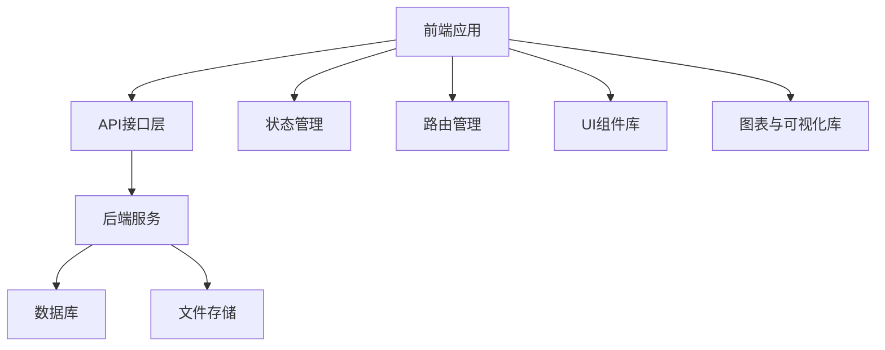
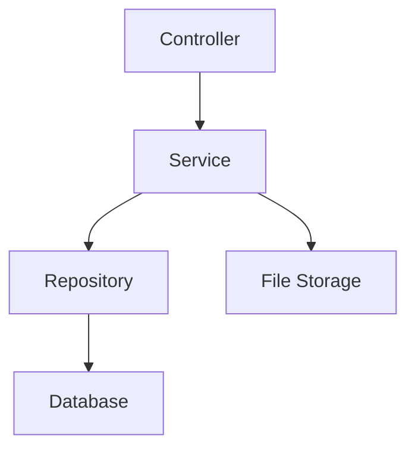
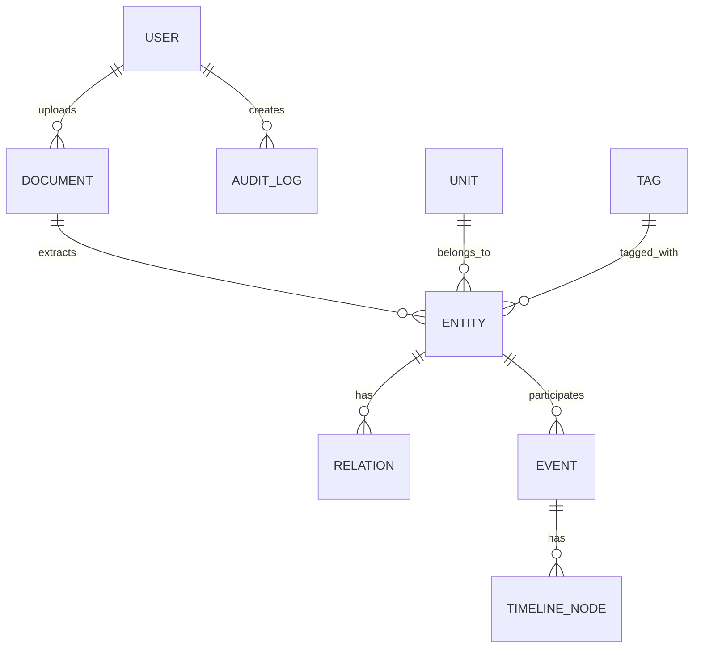

## 1. 架构设计


## 2. 技术描述
- 前端：React@18 + TypeScript + Tailwind CSS + Vite
- 初始化工具：vite-init
- 后端：Express@4 + TypeScript
- 数据库：PostgreSQL
- UI库：Ant Design
- 图表与可视化：ECharts、AntV G6
- 状态管理：Zustand
- 路由：React Router v6
- HTTP请求：Axios

## 3. 路由定义
| 路由路径 | 页面名称 | 主要功能 |
|----------|----------|----------|
| `/upload` | 文档上传 | 上传文档，填写核心归属、业务标签、关联单位 |
| `/audit/prefecture` | 地市审核 | 查看待审实体列表，合并/修正/通过/驳回 |
| `/audit/province` | 省厅汇总 | 跨地市实体合并，统一标准名称 |
| `/search` | 综合检索 | 百度风格搜索框，结果分页签（人物/单位/事件/文档） |
| `/entity/:type/:id` | 实体详情 | 展示实体属性、关联图谱、事件时间轴、原始文档 |
| `/dashboard` | 领导驾驶舱 | 全局统计图表、趋势、地图热力、最新预警 |
| `/admin` | 系统管理 | 用户权限、标签库管理、归属单位维护 |

## 4. API定义

### 4.1 文档上传
- **POST /api/document/upload**
  - 请求参数：`file` (binary), `metadata` (JSON)
  - 响应：`{ code: 0, message: "上传成功", data: { documentId: "doc_123" } }`

### 4.2 审核管理
- **GET /api/audit/prefecture**
  - 请求参数：`page`, `pageSize`
  - 响应：`{ code: 0, data: { total: 100, list: [...] } }`

- **POST /api/audit/merge**
  - 请求参数：`sourceId`, `targetId`
  - 响应：`{ code: 0, message: "合并成功" }`

- **POST /api/audit/pass**
  - 请求参数：`entityId`
  - 响应：`{ code: 0, message: "审核通过" }`

- **POST /api/audit/reject**
  - 请求参数：`entityId`, `reason`
  - 响应：`{ code: 0, message: "驳回成功" }`

### 4.3 综合检索
- **GET /api/search**
  - 请求参数：`keyword`, `type` (person/org/event/document), `page`, `pageSize`
  - 响应：`{ code: 0, data: { total: 23, list: [...] } }`

### 4.4 实体详情
- **GET /api/entity/:type/:id**
  - 响应：`{ code: 0, data: { basicInfo: {...}, graph: {...}, timelines: [...] } }`

### 4.5 领导驾驶舱
- **GET /api/dashboard/statistics**
  - 请求参数：`timeRange`, `units`
  - 响应：`{ code: 0, data: { kpi: {...}, caseTypeDistribution: [...], trend: {...}, heatmapData: [...], alerts: [...], relationGraph: {...} } }`

### 4.6 系统管理
- **GET /api/admin/users**
  - 响应：`{ code: 0, data: { list: [...] } }`

- **GET /api/admin/tags**
  - 响应：`{ code: 0, data: { list: [...] } }`

- **GET /api/admin/units**
  - 响应：`{ code: 0, data: { tree: [...] } }`

## 5. 服务器架构图


## 6. 数据模型

### 6.1 数据模型定义


### 6.2 数据定义语言

#### 用户表 (users)
```sql
CREATE TABLE users (
    id SERIAL PRIMARY KEY,
    name VARCHAR(100) NOT NULL,
    role VARCHAR(50) NOT NULL,
    core_unit_id VARCHAR(50) NOT NULL,
    related_unit_ids JSONB DEFAULT '[]',
    permissions JSONB DEFAULT '[]',
    created_at TIMESTAMP DEFAULT CURRENT_TIMESTAMP
);
```

#### 文档表 (documents)
```sql
CREATE TABLE documents (
    id VARCHAR(50) PRIMARY KEY,
    filename VARCHAR(255) NOT NULL,
    path VARCHAR(255) NOT NULL,
    size BIGINT NOT NULL,
    type VARCHAR(50) NOT NULL,
    uploader_id INTEGER REFERENCES users(id),
    core_unit_id VARCHAR(50) NOT NULL,
    business_tags JSONB DEFAULT '[]',
    related_unit_ids JSONB DEFAULT '[]',
    remark TEXT,
    status VARCHAR(50) DEFAULT 'uploaded',
    created_at TIMESTAMP DEFAULT CURRENT_TIMESTAMP
);
```

#### 实体表 (entities)
```sql
CREATE TABLE entities (
    id VARCHAR(50) PRIMARY KEY,
    name VARCHAR(100) NOT NULL,
    type VARCHAR(50) NOT NULL, -- person, org, event, document
    core_unit_id VARCHAR(50) NOT NULL,
    properties JSONB DEFAULT '{}',
    business_tags JSONB DEFAULT '[]',
    related_unit_ids JSONB DEFAULT '[]',
    status VARCHAR(50) DEFAULT 'pending_prefecture_audit',
    created_at TIMESTAMP DEFAULT CURRENT_TIMESTAMP
);
```

#### 关系表 (relations)
```sql
CREATE TABLE relations (
    id SERIAL PRIMARY KEY,
    source_id VARCHAR(50) REFERENCES entities(id),
    target_id VARCHAR(50) REFERENCES entities(id),
    relation_type VARCHAR(50) NOT NULL,
    created_at TIMESTAMP DEFAULT CURRENT_TIMESTAMP
);
```

#### 事件表 (events)
```sql
CREATE TABLE events (
    id VARCHAR(50) PRIMARY KEY,
    name VARCHAR(255) NOT NULL,
    description TEXT,
    start_time TIMESTAMP,
    end_time TIMESTAMP,
    core_unit_id VARCHAR(50) NOT NULL,
    status VARCHAR(50) DEFAULT 'active',
    created_at TIMESTAMP DEFAULT CURRENT_TIMESTAMP
);
```

#### 时间轴节点表 (timeline_nodes)
```sql
CREATE TABLE timeline_nodes (
    id SERIAL PRIMARY KEY,
    event_id VARCHAR(50) REFERENCES events(id),
    time TIMESTAMP NOT NULL,
    title VARCHAR(255) NOT NULL,
    description TEXT,
    doc_id VARCHAR(50) REFERENCES documents(id),
    evidence_url VARCHAR(255),
    created_at TIMESTAMP DEFAULT CURRENT_TIMESTAMP
);
```

#### 单位表 (units)
```sql
CREATE TABLE units (
    id VARCHAR(50) PRIMARY KEY,
    name VARCHAR(100) NOT NULL,
    parent_id VARCHAR(50) REFERENCES units(id),
    level INTEGER NOT NULL,
    created_at TIMESTAMP DEFAULT CURRENT_TIMESTAMP
);
```

#### 标签表 (tags)
```sql
CREATE TABLE tags (
    id SERIAL PRIMARY KEY,
    name VARCHAR(50) NOT NULL UNIQUE,
    category VARCHAR(50),
    created_at TIMESTAMP DEFAULT CURRENT_TIMESTAMP
);
```

#### 审核日志表 (audit_logs)
```sql
CREATE TABLE audit_logs (
    id SERIAL PRIMARY KEY,
    entity_id VARCHAR(50) REFERENCES entities(id),
    auditor_id INTEGER REFERENCES users(id),
    action VARCHAR(50) NOT NULL, -- pass, reject, merge
    comment TEXT,
    created_at TIMESTAMP DEFAULT CURRENT_TIMESTAMP
);
```